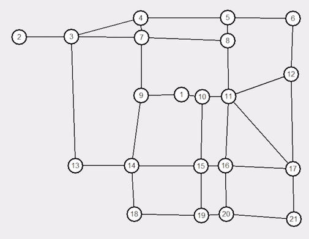
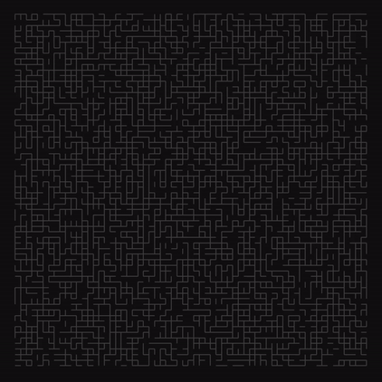

# Assignment 2: Optimal Search

## Dijkstra's Algorithm

```
a 0 O X   b I O X   c I O X   d I O X   e I O X
a 0 C X   b 6 O a   c I O X   d 2 O a   e I O X
a 0 C X   b 5 O d   c 4 O d   d 2 C a   e 8 O d
a 0 C X   b 5 O d   c 4 C d   d 2 C a   e 6 O c
a 0 C X   b 5 C d   c 4 C d   d 2 C a   e 6 O c

Cost: 6
e <- c <- d <- a
```

Code: [dijkstra.py](dijkstra.py)

## A*

```
Cost: 6.85

2 <- 3 <- 7 <- 9 <- 1
```



Code: [a_star_graphical.py](a_star_graphical.py)

### A* Maze



Code: [a_star_maze.py](a_star_maze.py)
