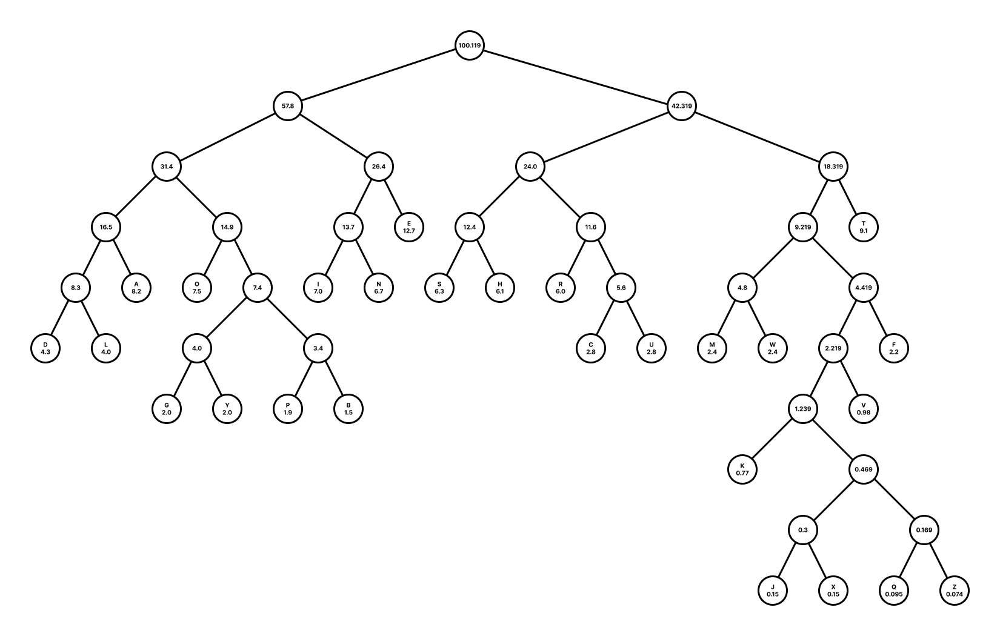

# Huffman Coding

Create a compression (i.e. Huffman code) tree for the eight most frequently used English letters according to 
[this chart](https://en.wikipedia.org/wiki/Letter_frequency). List the resulting code for each of the letters.

## Compression Tree



The tree was created in Figma and based on the first section of output of the code.

## Letter Codes

```
E: 011
T: 111
A: 0001
O: 0010
I: 0100
N: 0101
S: 1000
H: 1001
R: 1010
D: 00000
L: 00001
C: 10110
U: 10111
M: 11000
W: 11001
F: 11011
G: 001100
Y: 001101
P: 001110
B: 001111
V: 110101
K: 1101000
J: 110100100
X: 110100101
Q: 110100110
Z: 110100111
```

The second section of output is the list of letter codes.

## Code

```python
from __future__ import annotations
from dataclasses import dataclass


@dataclass
class Node:
    label: str
    value: float
    code: str
    left_child: Node or None
    right_child: Node or None


queue: list[Node] = [Node(parameters[0], parameters[1], '', None, None) for parameters in [
    ('A', 8.20), ('B', 1.50), ('C', 2.80), ('D', 4.30), ('E', 12.7), ('F', 2.20), ('G', 2.00), ('H', 6.10), ('I', 7.00),
    ('J', 0.15), ('K', 0.77), ('L', 4.00), ('M', 2.40), ('N', 6.70), ('O', 7.50), ('P', 1.90), ('Q', .095), ('R', 6.00),
    ('S', 6.30), ('T', 9.10), ('U', 2.80), ('V', 0.98), ('W', 2.40), ('X', 0.15), ('Y', 2.00), ('Z', .074)
]]

while len(queue) > 1:
    queue = sorted(queue, key=lambda x: x.value, reverse=True)

    right = queue.pop()
    left = queue.pop()

    queue.append(Node('', round(left.value + right.value, 3), '', left, right))

tree_string = ''
code_string = ''

while len(queue):
    next_queue = []

    for node in queue:
        left = node.left_child
        right = node.right_child

        output_string = ''

        if left:
            left.code = node.code + '0'

            if left.label:
                output_string += f'({left.label}) '
                code_string += f'{left.label}: {left.code}\n'

            output_string += f'{left.value}, '
            next_queue.append(left)

        if right:
            right.code = node.code + '1'

            if right.label:
                output_string += f'({right.label}) '
                code_string += f'{right.label}: {right.code}\n'

            output_string += f'{right.value}'
            next_queue.append(right)

        if left and right:
            tree_string += f'{node.value:<7} [ {output_string} ]\n'

    queue = next_queue

print(tree_string)
print(code_string)
```

The first section outputs each node value and the values and labels of each of its children if they exist.

```
100.119 [ 57.8, 42.319 ]
57.8    [ 31.4, 26.4 ]
42.319  [ 24.0, 18.319 ]
31.4    [ 16.5, 14.9 ]
26.4    [ 13.7, (E) 12.7 ]
24.0    [ 12.4, 11.6 ]
18.319  [ 9.219, (T) 9.1 ]
16.5    [ 8.3, (A) 8.2 ]
14.9    [ (O) 7.5, 7.4 ]
13.7    [ (I) 7.0, (N) 6.7 ]
12.4    [ (S) 6.3, (H) 6.1 ]
11.6    [ (R) 6.0, 5.6 ]
9.219   [ 4.8, 4.419 ]
8.3     [ (D) 4.3, (L) 4.0 ]
7.4     [ 4.0, 3.4 ]
5.6     [ (C) 2.8, (U) 2.8 ]
4.8     [ (M) 2.4, (W) 2.4 ]
4.419   [ 2.219, (F) 2.2 ]
4.0     [ (G) 2.0, (Y) 2.0 ]
3.4     [ (P) 1.9, (B) 1.5 ]
2.219   [ 1.239, (V) 0.98 ]
1.239   [ (K) 0.77, 0.469 ]
0.469   [ 0.3, 0.169 ]
0.3     [ (J) 0.15, (X) 0.15 ]
0.169   [ (Q) 0.095, (Z) 0.074 ]
```

The letter frequencies listed on the Wikipedia page do not add up to exactly 100% for some reason.
