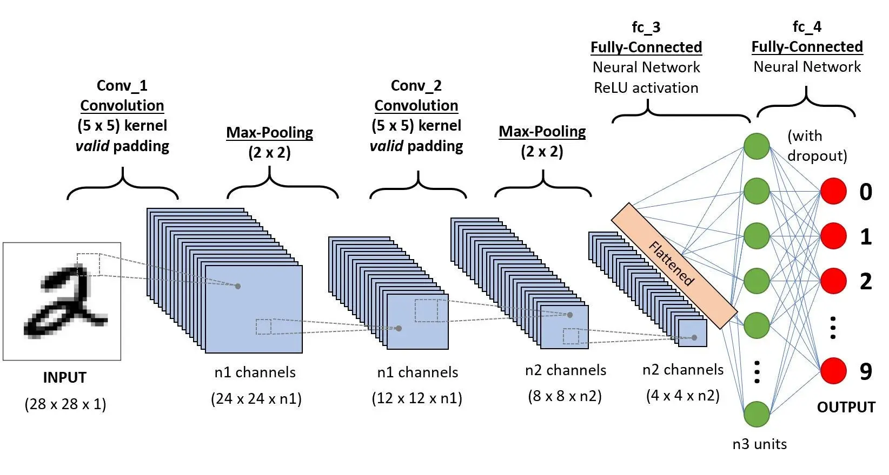
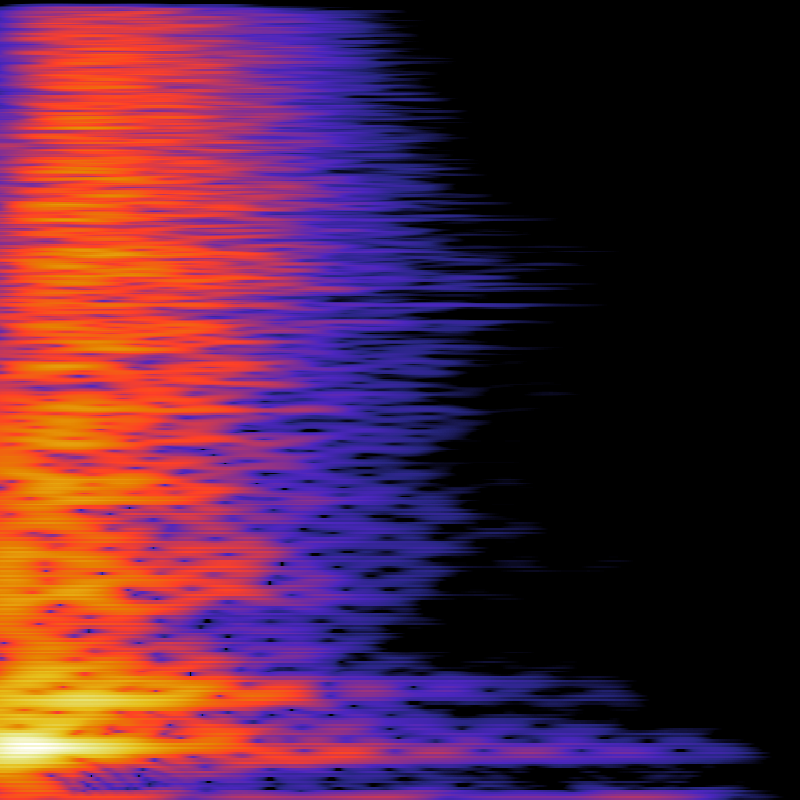

# Audio Identification with a Neural Network

The goal of this project is to identify audio data using a neural network.

A neural network is created to identify what instrument an audio file corresponds to.

## Convolutional Neural Network

A convolutional neural network that identifies images from a large set of data can also be used to analyze audio data if
the audio data can be represented as an image.



In the example above, images of handwritten digits are identified as a digit by the convolutional neural network.

## Image Representation of Audio

Sound can be represented as a change in frequencies over time. This can be graphed as a three-dimensional graph with one
axis as time, another as frequency, and another as the amount of that frequency present. As an image, the horizontal
axis can be time, the vertical axis can be frequency, and the color can be the amount of frequency present. 

This type of image is known as a spectrogram, and they are often depicted with all three color channels for easier 
viewing. However, for the purposes of using them in a neural network, the color channel can be grayscale since it is 
one-dimensional. Spectrograms are useful for audio processing, however, they are useful for other types of data 
involving waves, such as data used in seismology.

There exists more than one way to measure the frequencies of a wave over time. The two methods explored for this project
are Fast Fourier Transform (FFT) and Continuous Wavelet Transform (CWT).

### Fast Fourier Transform



The Fast Fourier Transform provides higher accuracy measurements when compared to the Continuous Wavelet
Transform, but less information about the time at which the frequencies occur.

### Continuous Wavelet Transform


The Continuous Wavelet Transform trades a bit of accuracy on the frequencies for more accurate time measurement.

Both of these spectrogram types will be generated for the same audio data set, and the performance of the neural network
on each type will be compared to infer which is better for machine learning on audio.

## Creating the Neural Network

This project uses a large selection of short audio files of instrument samples, containing many different versions of
the same instruments, which allows the neural network to learn. Each file is placed in a folder with the name of the
instrument.

The [spectrogram.py](spectrogram.py) file reads through all the audio files and generates the FFT and CWT
representations and places them in a separate folder.

The [neural_network.py](neural_network.py) file converts each image into floating point matrices for the input data, and
an integer corresponding to the instrument type for the output data. This data is split into training and testing data
so that the neural network can learn and test its performance. The convolutional neural network model is then ran on the
training data to generate the weights and tested against the testing data to measure its performance.

The number of images, size of the images, and the width and depth of the neural network can each contribute to the speed
at which the model can train. Images of 1000 x 1000 pixel dimensions or a hidden layer of width 1000 can cause the
model training to take hours.

## Running the Neural Network

With the following learning parameters,

```text
Learning Rate: 0.001
Momentum: 0.9
Epochs: 128
Batch Size: 32
```

the neural network consistently trains to 100% accuracy on the training data for both image types. For testing data,
both image types train to between 95% and 98%, however, the model trains to 97.5% extremely consistently with the 
Continuous Wavelet Transform images.

Generally, the performance of the CWT images are more consistent. However, with certain learning parameters, FFT can
perform better with less stability.

### Conclusion

Using fine-tuned learning parameters, Continuous Wavelet Transform spectrogram images of audio data can be used along
with a Convolutional Neural Network to create a model that consistently identifies a high percentage of unseen data.

With enough audio data and computational power, the accuracy and applicability of this audio identification model could
be greatly increased.

## Sources

* [https://stackoverflow.com/questions/57446015/scipy-spectrogram-with-logarithmic-frequency-axis](https://stackoverflow.com/questions/57446015/scipy-spectrogram-with-logarithmic-frequency-axis)
* [https://www.geeksforgeeks.org/matplotlib-pyplot-yscale-in-python/](https://www.geeksforgeeks.org/matplotlib-pyplot-yscale-in-python/)
* [https://wavbvkery.com/acoustic-drum-samples/](https://wavbvkery.com/acoustic-drum-samples/)
* [https://stackoverflow.com/questions/44787437/how-to-convert-a-wav-file-to-a-spectrogram-in-python3](https://stackoverflow.com/questions/44787437/how-to-convert-a-wav-file-to-a-spectrogram-in-python3)
* [https://en.wikipedia.org/wiki/Spectrogram](https://en.wikipedia.org/wiki/Spectrogram)
* [https://stackoverflow.com/questions/19587118/iterating-through-directories-with-python](https://stackoverflow.com/questions/19587118/iterating-through-directories-with-python)
* [https://docs.scipy.org/doc/scipy/reference/generated/scipy.signal.cwt.html](https://docs.scipy.org/doc/scipy/reference/generated/scipy.signal.cwt.html)
* [https://pywavelets.readthedocs.io/en/latest/ref/cwt.html](https://pywavelets.readthedocs.io/en/latest/ref/cwt.html)
* [https://stackoverflow.com/questions/78040946/wavelet-artifacts-with-basic-continuous-pywavelet](https://stackoverflow.com/questions/78040946/wavelet-artifacts-with-basic-continuous-pywavelet)
* [https://stackoverflow.com/questions/54179171/how-to-get-2d-wavelet-by-pywt-like-stft-from-a-wav-file](https://stackoverflow.com/questions/54179171/how-to-get-2d-wavelet-by-pywt-like-stft-from-a-wav-file)
* [https://adityadutt.medium.com/audio-classification-using-wavelet-transform-and-deep-learning-f9f0978fa246](https://adityadutt.medium.com/audio-classification-using-wavelet-transform-and-deep-learning-f9f0978fa246)
* [https://math.stackexchange.com/questions/279980/difference-between-fourier-transform-and-wavelets](https://math.stackexchange.com/questions/279980/difference-between-fourier-transform-and-wavelets)
* [https://ataspinar.com/2018/12/21/a-guide-for-using-the-wavelet-transform-in-machine-learning/](https://ataspinar.com/2018/12/21/a-guide-for-using-the-wavelet-transform-in-machine-learning/)
* [https://dsp.stackexchange.com/questions/72027/python-audio-analysis-which-spectrogram-should-i-use-and-why](https://dsp.stackexchange.com/questions/72027/python-audio-analysis-which-spectrogram-should-i-use-and-why)
* [https://ccrma.stanford.edu/%7Eunjung/mylec/WTpart1.html](https://ccrma.stanford.edu/%7Eunjung/mylec/WTpart1.html)
* [https://arxiv.org/pdf/1706.07156](https://arxiv.org/pdf/1706.07156)
* [https://github.com/OverLordGoldDragon/ssqueezepy](https://github.com/OverLordGoldDragon/ssqueezepy)
* [https://dsp.stackexchange.com/questions/71398/synchrosqueezing-wavelet-transform-explanation/71399#71399](https://dsp.stackexchange.com/questions/71398/synchrosqueezing-wavelet-transform-explanation/71399#71399)
* [https://www.mathworks.com/help/wavelet/ug/time-frequency-analysis-and-continuous-wavelet-transform.html](https://www.mathworks.com/help/wavelet/ug/time-frequency-analysis-and-continuous-wavelet-transform.html)
* [https://medium.com/analytics-vidhya/understanding-the-mel-spectrogram-fca2afa2ce53](https://medium.com/analytics-vidhya/understanding-the-mel-spectrogram-fca2afa2ce53)
* [https://towardsdatascience.com/musical-genre-classification-with-convolutional-neural-networks-ff04f9601a74](https://towardsdatascience.com/musical-genre-classification-with-convolutional-neural-networks-ff04f9601a74)

## Code

### `spectrogram.py`

```python
import librosa
import matplotlib.pyplot as plt
import numpy as np
from scipy import signal
import os

for subdir, dirs, files in os.walk('sounds'):
    for file in files:
        if file[-4:] == '.wav':
            file_name = os.path.join(subdir, file)
            print(f'Computing {file}... ', end='')

            plt.figure(figsize=(1, 1))
            plt.gca().set_axis_off()
            plt.subplots_adjust(top=1, bottom=0, right=1, left=0, hspace=0, wspace=0)
            plt.margins(0, 0)

            y, sr = librosa.load(file_name, mono=True)

            nfft = 2048
            p = librosa.feature.melspectrogram(y=y, sr=sr, n_fft=nfft, hop_length=1, n_mels=nfft // 4,
                                               win_length=nfft // 2)
            librosa.display.specshow(librosa.power_to_db(p, ref=np.max), x_axis='s', y_axis='mel', cmap='binary_r')

            plt.savefig(f'images/{file_name[7:-4]}.png')
            plt.close()

            plt.figure(figsize=(1, 1))
            plt.gca().set_axis_off()
            plt.subplots_adjust(top=1, bottom=0, right=1, left=0, hspace=0, wspace=0)
            plt.margins(0, 0)

            cwtmatr = signal.cwt(y[:2500], signal.ricker, np.arange(1, 200))
            cwtmatr_yflip = np.flipud(cwtmatr)
            plt.imshow(cwtmatr_yflip, cmap='binary_r', aspect='auto', vmax=abs(cwtmatr).max(), vmin=-abs(cwtmatr).max())

            plt.savefig(f'images_cwt/{file_name[7:-4]}.png')
            plt.close()

            print('Done.')
```

### `neural_network.py`

```python
import torch
import torch.nn as nn
from skimage import io
import du.lib as dulib
import math
import os

image_size = 100

train_amount = 0.8
learning_rate = 0.001
momentum = 0.9
epochs = 128
batch_size = 32
centered = True
normalized = True

yss_dictionary = {}
yss_list = []
xss_list = []

print('Reading images')

for subdir, dirs, files in os.walk('images'):
    for file in files:
        if file[-4:] == '.png':
            yss_dictionary[subdir] = 0
            yss_list.append(list(yss_dictionary.keys()).index(subdir))
            xss_list.append(io.imread(os.path.join(subdir, file), as_gray=True))
            print('.', end='')

print()

yss = torch.LongTensor(len(yss_list))
xss = torch.FloatTensor(len(xss_list), image_size, image_size)

for i in range(len(yss_list)):
    yss[i] = yss_list[i]

for i in range(len(xss_list)):
    xss[i] = torch.FloatTensor(xss_list[i])

random_split = torch.randperm(xss.size(0))
train_split_amount = math.floor(xss.size(0) * train_amount)

xss_train = xss[random_split][:train_split_amount]
xss_test = xss[random_split][train_split_amount:]

if centered:
    xss_train, xss_train_means = dulib.center(xss_train)
    xss_test, _ = dulib.center(xss_test, xss_train_means)

if normalized:
    xss_train, xss_train_stds = dulib.normalize(xss_train)
    xss_test, _ = dulib.normalize(xss_test, xss_train_stds)

yss_train = yss[random_split][:train_split_amount]
yss_test = yss[random_split][train_split_amount:]

image_dimensions = image_size * image_size


class ConvolutionalModel(nn.Module):
    def __init__(self):
        super(ConvolutionalModel, self).__init__()
        self.meta_layer1 = nn.Sequential(
            nn.Conv2d(in_channels=1, out_channels=16, kernel_size=5, stride=1, padding=2),
            nn.ReLU(),
            nn.MaxPool2d(kernel_size=2, stride=2, padding=0)
        )
        self.meta_layer2 = nn.Sequential(
            nn.Conv2d(in_channels=16, out_channels=32, kernel_size=5, stride=1, padding=2),
            nn.ReLU(),
            nn.MaxPool2d(kernel_size=2, stride=2, padding=0)
        )
        self.fc_layer1 = nn.Linear(image_dimensions * 2, image_dimensions)
        self.fc_layer2 = nn.Linear(image_dimensions, len(yss_list))

    def forward(self, forward_xss):
        forward_xss = torch.unsqueeze(forward_xss, dim=1)
        forward_xss = self.meta_layer1(forward_xss)
        forward_xss = self.meta_layer2(forward_xss)
        forward_xss = torch.reshape(forward_xss, (-1, image_dimensions * 2))
        forward_xss = self.fc_layer1(forward_xss)
        forward_xss = self.fc_layer2(forward_xss)
        return torch.log_softmax(forward_xss, dim=1)


model = ConvolutionalModel()
criterion = nn.NLLLoss()


def pct_correct(xss_test_, yss_test_):
    count = 0

    for x, y in zip(xss_test_, yss_test_):
        if torch.argmax(x).item() == y.item():
            count += 1

    return 100 * count / len(xss_test_)


model = dulib.train(
    model,
    crit=criterion,
    train_data=(xss_train, yss_train),
    valid_data=(xss_test, yss_test),
    learn_params={'lr': learning_rate, 'mo': momentum},
    epochs=epochs,
    bs=batch_size,
    valid_metric=pct_correct,
    graph=0,
    print_lines=(-1,),
    gpu=(-1,)
)

pct_training = dulib.class_accuracy(model, (xss_train, yss_train), show_cm=False)

pct_testing = dulib.class_accuracy(model, (xss_test, yss_test), show_cm=False)

print(
    f'\n'
    f'Percentage correct on training data: {100 * pct_training:.2f}\n'
    f'Percentage correct on testing data: {100 * pct_testing:.2f}\n'
    f'\n'
    f'Learning Rate: {learning_rate}\n'
    f'Momentum: {momentum}\n'
    f'Epochs: {epochs}\n'
    f'Batch Size: {batch_size}'
)
```
